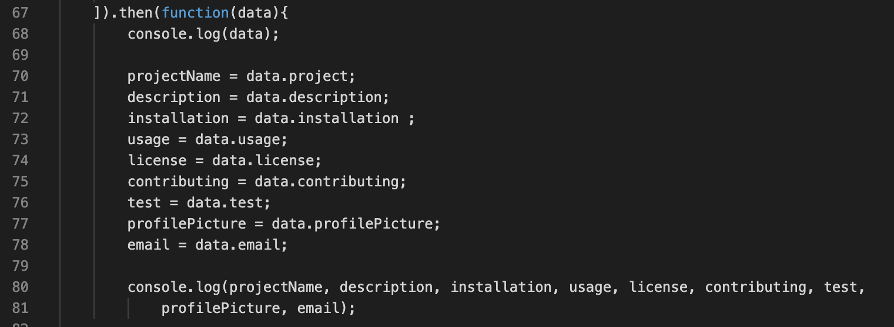

# Node.js-README-Generator
Using Node.js to build a quality README with information about the app


## Table of Content
- Objective
- Deploy Link
- Getting Started
- Code Highlights
- Technology
- Author 

## Objectives
Create an open source project that makes a quality README anyone can use, in will include a title, description, table of contents, instillation, usage, license, contributing, tests, questions and at least one badge. 

## Deploy Link
https://ayladillis.github.io/Node.js-and-ES6-Good-README-Generator/

## Getting Started
These instructions will get you a copy of the project up and running on your local machine for development and testing purposes. See deployment for notes on how to deploy the project on a live system.

```
$ git clone git@github.com:ayladillis/Good-README.git
ayladillis/Good-README.git
$ cd ayladillis/Good-README.git
```
Then open in your preferred text editor:
- [vim](https://www.vim.org/) 
- [emmacs](https://www.gnu.org/software/emacs/)
- [visual studio code](https://code.visualstudio.com/) 

## Code Highlight
I used the .then function to call the promis




## Technology
* [Javascript](https://developer.mozilla.org/en-US/docs/Web/JavaScrip)
* [Node.js](https://node.js.org/)


## Authors 
- [Ayla Dillis](https://github.com/ayladillis)
- email: aayladillis@gmail.com